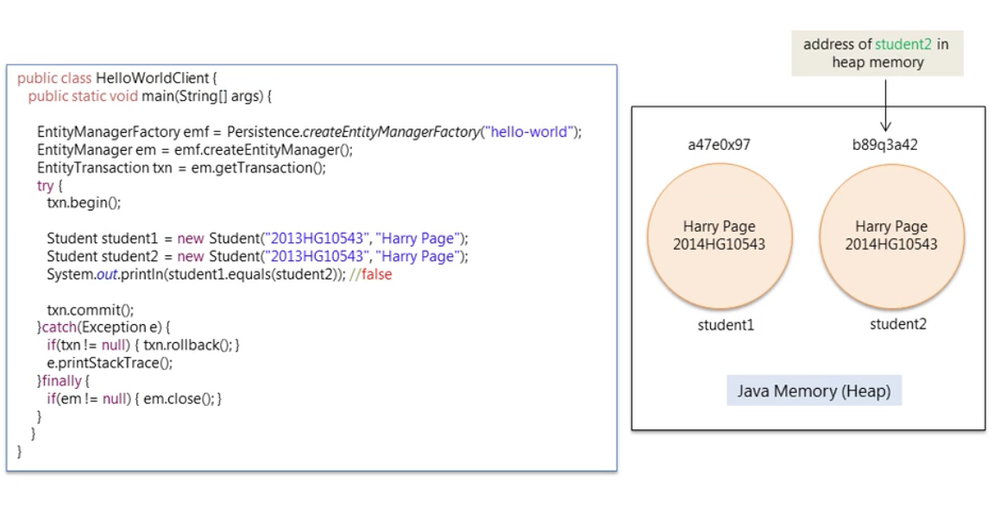
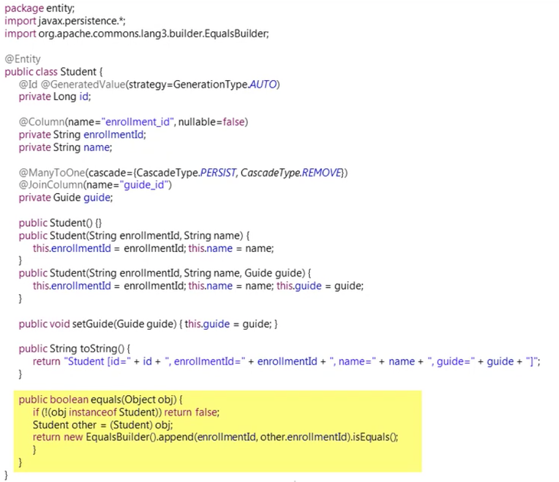
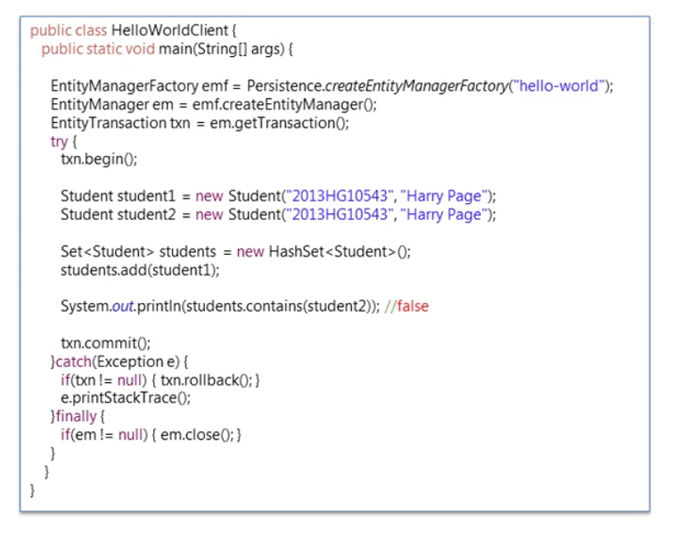
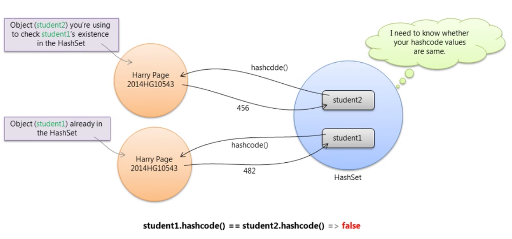
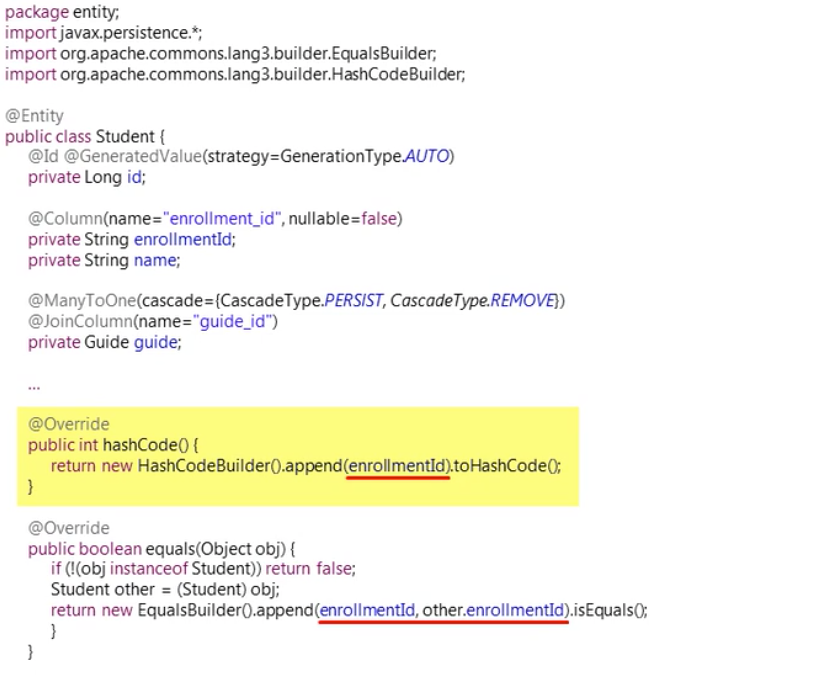

# Equals

set collection을 사용할 경우 중복된 element를 가질 수 없기 때문에 위의 코드처럼 student object 가 같은 entity 값을 같는다 하더라도 두 object는 같지 않다. 

`System.out.println(student1.equals(student2));` 는 false를 리턴 하는데 그 이유는 set 안에 같은 object가 존재 할 수 없기 때문에 student1과 student2는 서로 다른 object address를 가진다. 

이 경우엔 entity class에 다음과 같이 equal bulider를 추가해줘야 한다.

# Hashcode

Eqauls 메소드를 구현했다면 Hashcode 메소드도 함께 구현 하여야 한다.

두 object가 같다면 hashcode 역시 같아야 한다.

