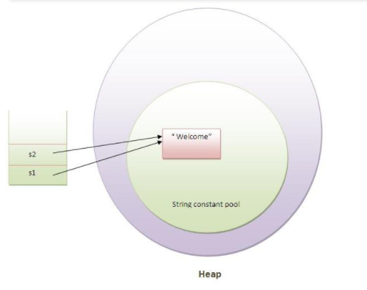
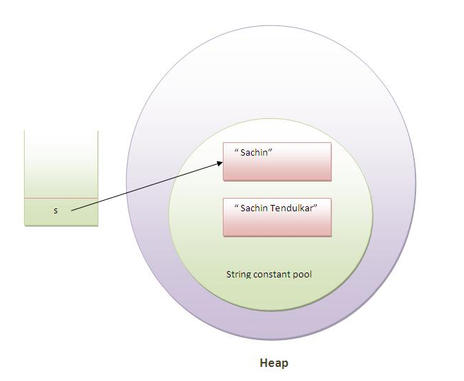

In java, String is an **Object** that represents sequence of character. The java.lang.String class is used to create string object

There are two ways to create string object.

1. by String literal

2. by new keyword

# 1. String literal

### String objects are stored in a special memory are known as string constant pool

Each time you create a string literal, the JVM check the string constant pool first. If the string already exists in the pool, a reference to the pooled instance is returned. If string doesn't exist in the pool, a new string instance is created and placed in the pool. For example:

```java
String s1="Welcome";  
String s2="Welcome";//will not create new instance  
```



In the above exmaple only one object will be created. Firstly JVM will not find any string object with the value "Welcome" in string constant pool, so it will create a new object. After that it will find the string with the value "Welcome" in the pool, it will not create new object but will return the reference to the same instance.

## Why we use String literal?

To make Java more memory efficient. Because no new objects are created if it exists already in string constant pool.

# 2. new keyword

```java
String s=new String("Welcome");//creates two objects and one reference variable 
```

When you create a string object with `new` keyword, JVM will create a new string object in normal(non pool) heap memory and the literal "Welcome" will be placed in the string constant pool. The varable `s` will refer to the object in heap(non pool).


# String, StringBuffer, StringBuilder

Java `String` is `immutable`. It cannot be changed. Meaning whenever we changed any string, a new instance is created. 
For `mutable` string, we use `StringBuffer` and `StringBuilder` class.

|            | **String** |  **StringBuffer**| **StringBuilder** |
|------------|-------------|------------|------------|
| **Storage Area**   | Constant String Pool |  Heap |    Heap 
| **Modifiable**     | No (immutable) | Yes( mutable ) | Yes( mutable )
| **Thread Safe**    | Yes      | Yes | No  
| **Performance**    | Fast      | Very slow   | Fast   


## Immutable String

```java
class Testimmutablestring{  
 public static void main(String args[]){  
   String s="Sachin";  
   s.concat(" Tendulkar");//concat() method appends the string at the end  
   System.out.println(s);//will print Sachin because strings are immutable objects  
 }  
}  
```
```
Output:Sachin
```




What if we want to assign it to the reference variable?

```java
class Testimmutablestring1{  
 public static void main(String args[]){  
   String s="Sachin";  
   s=s.concat(" Tendulkar");  
   System.out.println(s);  
 }  
}  

```

```
Output:Sachin Tendulkar
```

## Why string objects are immutable?
Suppose there are 4 reference variables, all refers to one object. If one reference variable changes the value of the object, it will be affected to all the reference variables. That is why string objects are immutable in java.

# Reference
[Java T point - String](https://www.javatpoint.com/java-string)
