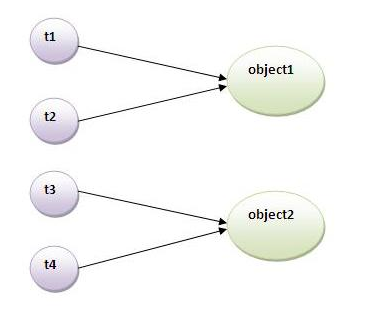
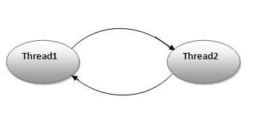
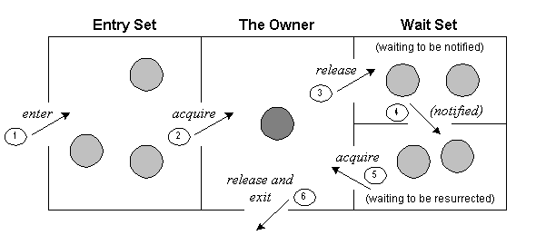

# Synchronization in Java

`Synchronization` in java is the capability to control the access of multiple threads to any shared resource.

Java Synchronization is better option where we want to allow only one thread to access the shared resource.

It is mainly used to prevent `thread interference` and `consistency problem`.


## Lock in Object
Every object has an lock. When a `thread` needs consistent access to an object's field, 
the thread has to acquire the object's lock before accessing them. Then, release the lock when it's done with them.

## Synchronized method example

[Example code reference](https://www.javatpoint.com/synchronization-in-java)
```java
class Table{  
 synchronized void printTable(int n){//synchronized method  
   for(int i=1;i<=5;i++){  
     System.out.println(n*i);  
     try{  
      Thread.sleep(400);  
     }catch(Exception e){System.out.println(e);}  
   }  
 }  
} 


  
class MyThread1 extends Thread{  
Table t;  
MyThread1(Table t){  
this.t=t;  
}  
public void run(){  
t.printTable(5);  
}  
  
}  
class MyThread2 extends Thread{  
Table t;  
MyThread2(Table t){  
this.t=t;  
}  
public void run(){  
t.printTable(100);  
}  
}  
  
public class TestSynchronization2{  
public static void main(String args[]){  
Table obj = new Table();//only one object  
MyThread1 t1=new MyThread1(obj);  
MyThread2 t2=new MyThread2(obj);  
t1.start();  
t2.start();  
}  
}  
```

```
Output: 5
       10
       15
       20
       25
       100
       200
       300
       400
       500
```

If we declare mehotd without `Synchronization`

```java
Class Table{  
  
void printTable(int n){//method not synchronized  
   for(int i=1;i<=5;i++){  
     System.out.println(n*i);  
     try{  
      Thread.sleep(400);  
     }catch(Exception e){System.out.println(e);}  
   }  
  
 }  
}  
```

Output would be 

```
Output: 5
       100
       10
       200
       15
       300
       20
       400
       25
       500
```

## Synchronized method example with anonymous function

We can use anonymous function for threads, so less coding.

```java
//Program of synchronized method by using annonymous class  
class Table{  
 synchronized void printTable(int n){//synchronized method  
   for(int i=1;i<=5;i++){  
     System.out.println(n*i);  
     try{  
      Thread.sleep(400);  
     }catch(Exception e){System.out.println(e);}  
   }  
  
 }  
}  
  
public class TestSynchronization3{  
public static void main(String args[]){  
final Table obj = new Table();//only one object  
  
Thread t1=new Thread(){  
public void run(){  
obj.printTable(5);  
}  
};  
Thread t2=new Thread(){  
public void run(){  
obj.printTable(100);  
}  
};  
  
t1.start();  
t2.start();  
}  
}  
```

## Synchronized block
Instead of using synchronized method, we can perform synchronization on certain block in the method.

Suppose you got 30 lines of code in your method and you want to synchronize only 10 lines. You can use syncrhonized block.

**Syntax**
```java
synchronized (object reference expression) {   
  //code block   
} 
```

**Example**
```java
class Table{  
  
void printTable(int n){  
   synchronized(this){//synchronized block  
     for(int i=1;i<=5;i++){  
      System.out.println(n*i);  
      try{  
       Thread.sleep(400);  
      }catch(Exception e){System.out.println(e);}  
     }  
   }  
}//end of the method  
}  
  
public class TestSynchronizedBlock2{  
public static void main(String args[]){  
final Table obj = new Table();//only one object  
  
Thread t1=new Thread(){  
public void run(){  
obj.printTable(5);  
}  
};  
Thread t2=new Thread(){  
public void run(){  
obj.printTable(100);  
}  
};  
  
t1.start();  
t2.start();  
}  
}  
```

```
Output:5
       10
       15
       20
       25
       100
       200
       300
       400
       500
```

# Static synchronization



Suppose there are two objects(object1, object2) of a shared class.
In case of synchronized method and block, t1 and t2 cannot interfere each other. Same for t3 and t4. Because t1 and t2 both refer to a common object that has a single lock.
However, There can be interference between t1 and t3 or t2 and t4 because t1 acquires another lock and t3 acquires anotehr lock.

Here comes the `static synchronization`.

If you make any static method as synchronized, the lock will be on the `class` not on `object`.

## synchronized block on a class lock

```java
static void printTable(int n) {  
    synchronized (Table.class) {       // Synchronized block on class A  
        // ...  
    }  
}  
```

# Deadlock



A thread(thread1) is waiting for an object lock, that is acquried by another thread(trhead2). And thread 2 is waiting for an object lock that is acquried by thread 2. Both threads are waiting for each other to release the lock. This is called `deadlock`.

# Inter-thread communication

* wait() - make current thread to release the lock and wait until another thread invokes notify() or notifyAll() method.

* notify() - wakes up a single thread which is in wait set. The thread is randomly picked.

* notifyAll() - wakes up all thread in wait set.


Inter-thread communication model - [Diagram from javatpoint](https://www.javatpoint.com/inter-thread-communication-example)


* wait(), notify() and notifyAll() methods are defined in Object class not Thread class. Because they are related to loack and object has a lock.

* sleep() method is defined in Thread class and it doesn't release the lock.

* wait() method is defined in Object class and it does release the lock.

# Interrupting a thread

* If call interrupt() to any thread which is in sleeping or wait state, it will throw InterruptedException. 

* If thread are not in sleeping or waiting state, calling interrupt() doesn't interrupt the thread but sets the interrupt flag to true.

# Reference
[Java T Point - Synchronization in java](https://www.javatpoint.com/synchronization-in-java)
