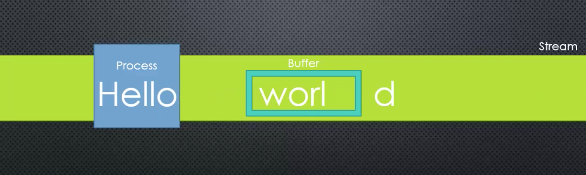
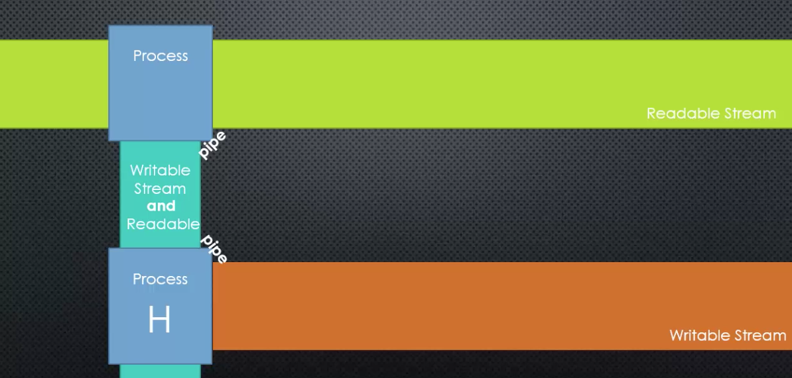

## Buffer
A temporary holding spot for data being moved from one place to another. It is intentionally limited in size.

## Stream
A sequence of data made available over time. Pieces of data that eventually combine into a whole.

## Chunk
A piece of data being sent through a stream. Data is split in `chunks` and streamed.

## Buffering

Certain amount of data is gathered into the buffer and then processed. 
Gathering enough data for it to continue watching and processing the video

## Pipes

Connecting two streams by writing to one stream what is being read from another. In NOde you pipe from a readable stream to a writable stream.

# Reference
[Udemy: Understand Node JS](https://www.udemy.com/understand-nodejs)